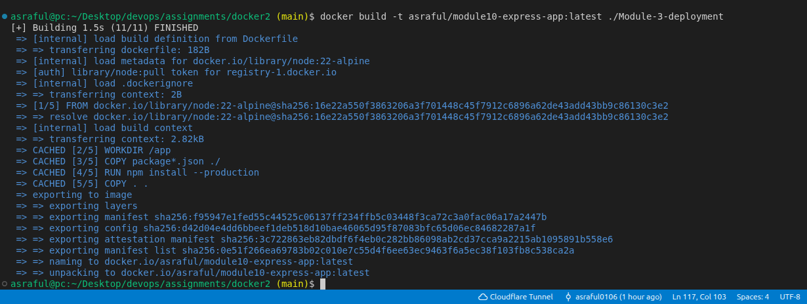
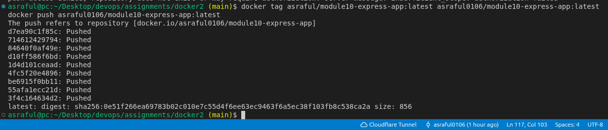
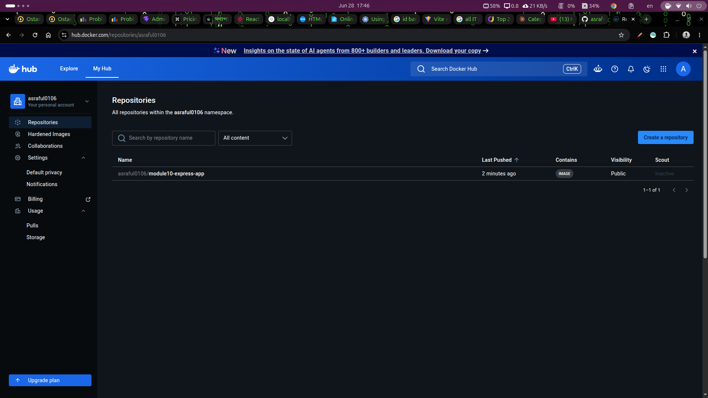
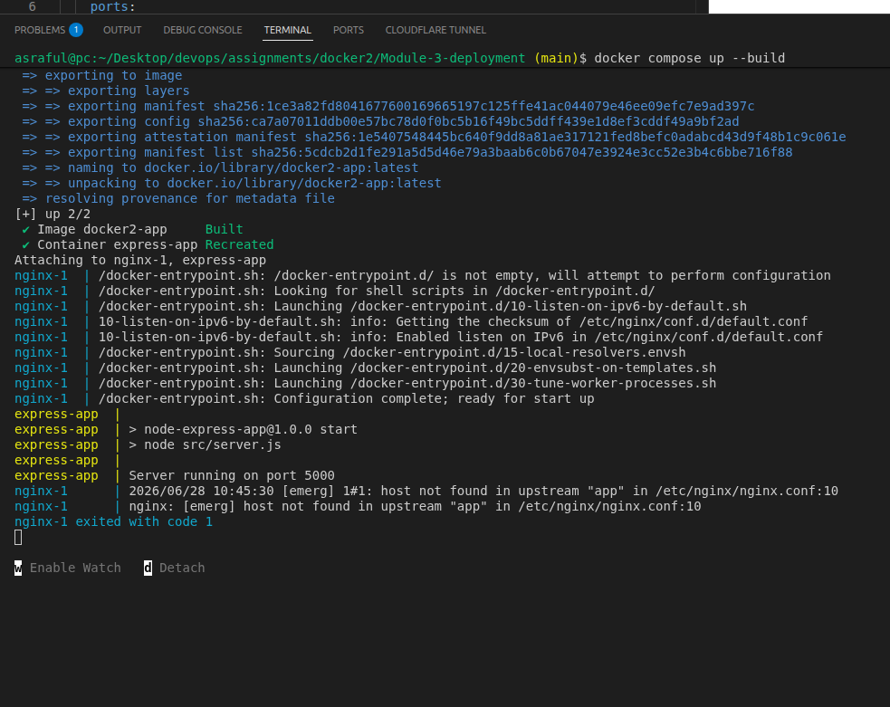
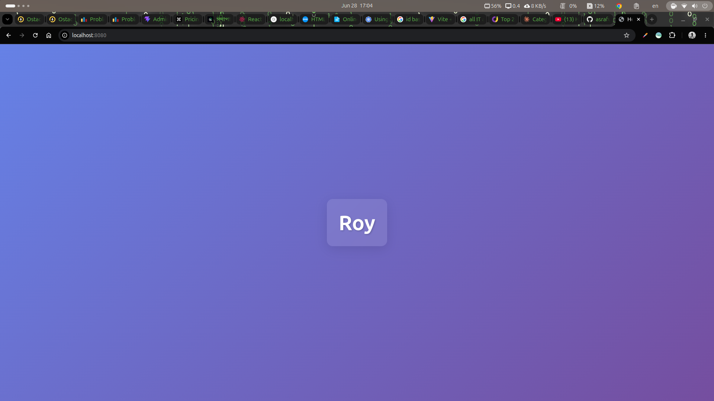
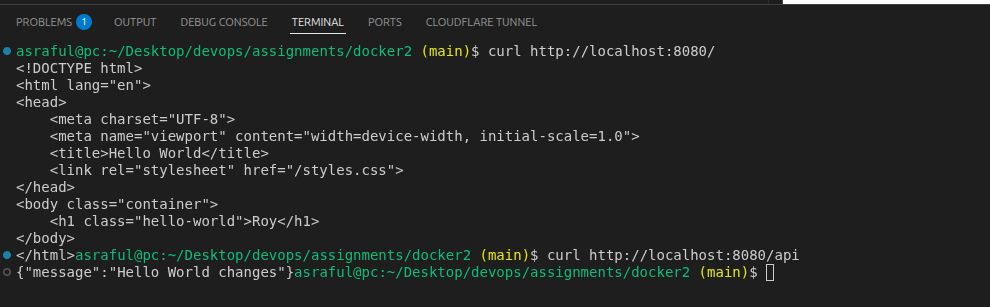

## Step 1: Clone the Repository

```bash
git clone https://github.com/roy35-909/Module-3-deployment.git
cd Module-3-deployment
```

---

## Step 2: Create the Dockerfile

Create a file named `Dockerfile` in the root of the project:

```dockerfile
FROM node:18-alpine

WORKDIR /app 

COPY package*.json ./

RUN npm install --production

COPY . . 

EXPOSE 3000

ENV PORT=3000

CMD ["npm", "start"]
```
---

## Step 3: Create the Nginx Configuration

Create a file named `nginx.conf` in the root of the project:

```nginx
events {
    worker_connections 1024;
}

http {
    server {
        listen 8080;

        location / {
            proxy_pass http://app:3000;
            proxy_http_version 1.1;
            proxy_set_header Host $host;
            proxy_set_header X-Real-IP $remote_addr;
            proxy_set_header X-Forwarded-For $proxy_add_x_forwarded_for;
        }
    }
}
```

---

## Step 4: Create the docker-compose.yml

Create a file named `docker-compose.yml` in the root of the project:

```yaml
version: "3.8"

services:
  nginx:
    image: nginx:alpine
    ports:
      - "8080:8080"
    volumes:
      - ./nginx.conf:/etc/nginx/nginx.conf:ro
    depends_on:
      - app

  app:
    build:
      context: .
      dockerfile: Dockerfile
    container_name: express-app
    expose:
      - "3000"
    restart: unless-stopped
```

**Key points:**
- `nginx` uses the official `nginx:alpine` image (just runs it, no build).
- `app` is built from our `Dockerfile`.
- `app` starts before `nginx` is considered ready (`depends_on`).
- Only port `8080` is exposed to the host — through Nginx.


---

## Step 5: Build and Push the Docker Image to DockerHub

### 5.1 Log in to DockerHub

```bash
docker login
```


### 5.2 Build the image with my DockerHub username

```bash
docker build -t <my-dockerhub-username>/module10-express-app:latest .
```

Example:
```bash
docker build -t asraful/module10-express-app:latest .
```



### 5.3 Push the image to DockerHub

```bash
docker push <my-dockerhub-username>/module10-express-app:latest
```



### 5.4 Verify on DockerHub

Go to `https://hub.docker.com/r/<my-dockerhub-username>/module10-express-app` and confirm the image is listed.



---

## Step 6: Run Everything with Docker Compose

```bash
docker compose up --build
```

I should see both containers starting — Nginx and the Express app.


To run in detached (background) mode:

```bash
docker compose up --build -d
```

Check running containers:

```bash
docker compose ps
```

> 📸 **Screenshot required:** Output of `docker compose ps` showing both `nginx` and `express-app` containers with status `Up`.

---

## Step 7: Verify in the Browser

Open my browser and go to:

- **Home route:** `http://localhost:8080/` → Should display a Hello World page
- **API route:** `http://localhost:8080/api` → Should return a JSON response



---

## Step 8: Verify with curl (optional but recommended)

```bash
curl http://localhost:8080/
curl http://localhost:8080/api
```




---

## Commit and Push Files to GitHub

```bash
git add Dockerfile docker-compose.yml nginx.conf README.md
git commit -m "Add Dockerfile, docker-compose.yml, and nginx config for Module 10"
git push origin main
```

---

## Stop the Containers

```bash
docker compose down
```
---
## DockerHub Image Link

```
https://hub.docker.com/r/asraful0106/module10-express-app
```


---

## Architecture Summary

```
Browser (port 8080)
       │
       ▼
  ┌─────────┐
  │  Nginx  │  ← nginx:alpine (official image, no build)
  │  :8080  │
  └────┬────┘
       │ proxy_pass http://app:3000
       ▼
  ┌─────────┐
  │  Express│  ← Built from Dockerfile
  │   :3000 │
  └─────────┘
```

- Nginx acts as a reverse proxy, receiving traffic on port 8080 and forwarding it to the Express app on port 3000.
- The Express app is **not** directly exposed to the host — all traffic goes through Nginx.
- Docker Compose manages both services and their startup order.